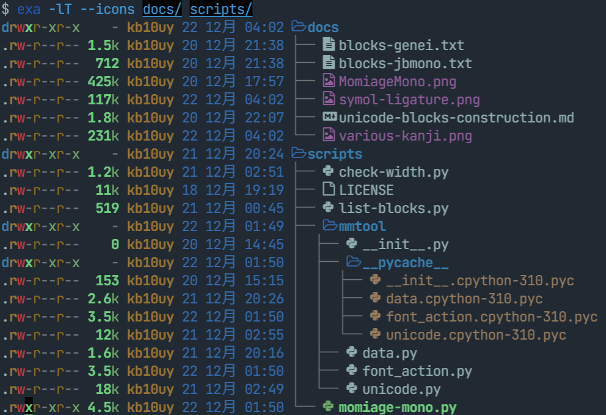

# Momiage Mono

## ダウンロード
現在の最新バージョンは **Build 1.1-20221222** です。

[Release ページ](https://github.com/kb10uy/MomiageMono/releases)から `MomiageMono-1.1-20221222.zip` をダウンロードしてください。

## 概要
Momiage Mono は、以下のフォントを合成した主にコーディングを想定した等幅フォントです。

- 欧文: [JetBrains Mono](https://www.jetbrains.com/ja-jp/lp/mono/)
- 日本語: [源暎モノゴ](https://okoneya.jp/font/genei-mono-go.html)
- アイコン類: [Nerd Fonts](https://www.nerdfonts.com/)

## 特徴

### 源暎モノゴ由来の豊富な漢字

源暎モノゴの源流にある源ノ角ゴシックには、JIS 第 1,2 水準だけでなく豊富な漢字が収録されています。より多様な文章をこのフォントひとつで表示することができます。

### JetBrains Mono 由来の記号のリガチャ

JetBrains Mono にはコーディング用途に特化した記号類のリガチャが収録されており、 Momiage Mono はこれを継承しています。

### Nerd Font 由来の多様なアイコン

Momiage Mono には Nerd Font の Font Patcher を適用しています。色々なアイコンが表示されてたのしい。

### 5:3 の半角グリフに対応した 5:6 相当の全角グリフ
JetBrains Mono のグリフは比率が 5:3 となっているため、一般的な日本語フォントとそのまま合成すると「半角 2 文字と全角 1 文字の幅が一致しない」ということが起こります。エディタならともかく、コンソールアプリなど厳密にこの要件を要求する場面ではこれは致命的といえます。

JetBrains Mono を合成しているフォントとしては他に [UDEV Gothic](https://github.com/yuru7/udev-gothic) があります。 UDEV Gothic では JetBrains Mono のグリフの横幅を縮小したものと 5:3 のまま合成したバリエーションが用意されています。

Momiage Mono では、**全角文字が 5:6 となるように拡大・移動する**という方針によって上記の問題を解決しています。この代償として、**源暎モノゴ由来の全角グリフのほとんどはフォントの Ascent より上にはみ出しています**(OS/2 Win Ascent の値よりは下に収まっています)。行が重なってしまう場合、line-height を 1.2~1.3 程度に設定してご利用ください。なお、 JetBrains Mono 由来のグリフは line-height が 1.0 の状態でも重ならないようになっています。

### `East_Asian_Width: A` の半角への統一
Unicode には East_Asian_Width という属性があり、かつて東アジア圏で全角として、それ以外の地域では半角として扱われてきた文字については `A (Ambiguous)` が割り当てられています。

Momiage Mono では、**これらの文字を全て半角に統一しています**。 JetBrains Mono に収録されているグリフはそのまま、源暎モノゴに収録されているグリフは半角に収まるように縮小・移動する処理を施しています。これにより、日本語表示を想定していないターミナルアプリでの表示のずれが軽減されることが期待されます。

## 自分でビルドする

### 必要なもの
* Python (3.10 以上)
* [FontForge](https://fontforge.org/en-US/)

### 手順
1. 源暎モノゴを上記リンクからダウンロードして、 `dist/gen-ei-mono-go/GenEiMonoGothic_v1.0.zip` に配置
2. `bash setup.bash`
3. `bash generate.bash`

## ライセンス
- 合成されたフォントは SIL Open Font License 1.1 でライセンスされています。
- 合成用のスクリプトは Apache License 2.0 でライセンスされています。
